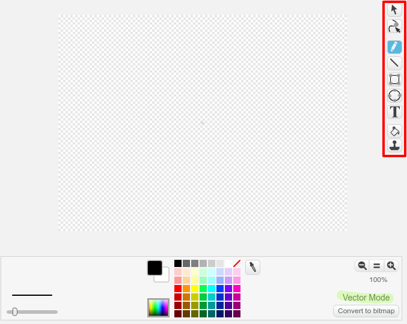

The Scratch paint tool has two modes: bitmap and vector. Vector mode stores your picture as shapes and lines that you can move around individually. This is really useful!

When you are in bitmap mode you can click **Convert to vector** to switch to vector mode.

In vector mode, the tools appear on the right side of the drawing area.

Choose the select tool (the arrow) to move, resize, and rotate shapes and lines.

